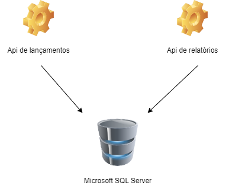
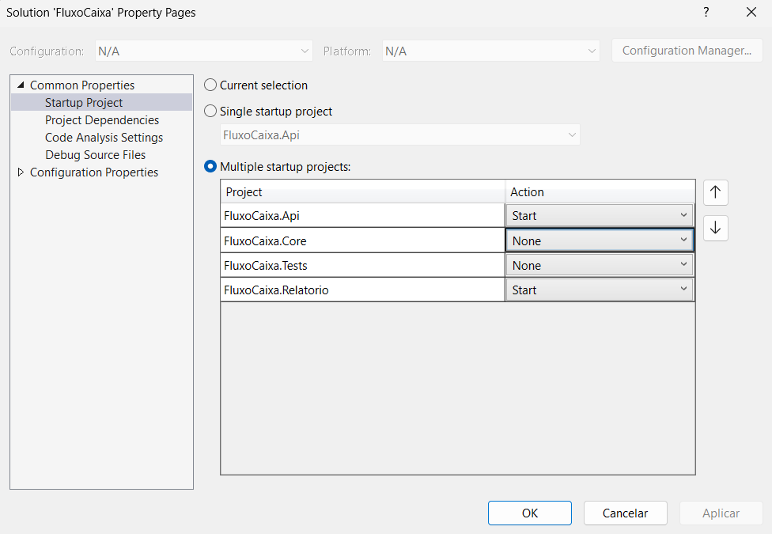

Exemplo da construções de serviços para realizar lançamentos financeiros diários.

## Tecnologias utilizadas

.Net 7.
Entity Framework Core.
Dapper.
FluentValidation .
MediatR.
Swagger.
xUnit.
Microsoft SQL Server.

## Arquitetura

## Descrição

Trata-se de uma aplicação distribuída com dois serviços. Um serviço para efetuar lançamentos e criar caixas e outro seriço para extração de relatórios.

Para efetuar uma transação primeiramente crie um caixa.
Com o id criado basta efetuar uma transação, informando se débito ou crédito.
Para débitos, é necessário ter saldo em caixa.

## Iniciando

Para rodar localmente configure o Visual Studio para startups multiplos:

Após, basta iniciar a aplicação via Visual Studio: `F5`

A aplicação está configurada para rodar via docker containers. Baixe o projeto para o seu computador e na basta `_docker_` localizada na raixa do projeto, execute o comando `docker compose up`.

Em ambos os casos a api de lançamento ficará na url: 
`http://localhost:5001/swagger/index.html`

E a api de relatório na url:
`http://localhost:5003/swagger/index.html`

Ao rodar localmente ou via conteiner, o banco de dados será criado automaticamente (no primeiro caso é necessário o serviço do Microsoft SQL Server instalado no seu computador).

